# Housing Analysis in King County, Washington
## Linear Regression Analysis

## Business Challenge
#### A local realtor wants to know which features are affecting home prices the most in King County. The realtor does work in all of the areas of King County. A regression will help the client better understand which homes to show and when to highlight the important features to prospective home buyers. 
#### Important features will be qualified as those features which most affect the price of a home. 


```python
import warnings

warnings.filterwarnings('ignore')

import pandas as pd
import numpy as np 
import csv

import scipy.stats as scs
import matplotlib.patches as patches
import statsmodels.api as sm
import statsmodels.formula.api as sms
import scipy.stats as stats
from pltfunctions import hist_kde_plots as hk
from statsFunctions import adjusted_r_squared as clc
from statsFunctions import check_model as cm
from statsFunctions import check_vif_feature_space
from statsFunctions import build_sm_ols
from statsFunctions import check_residuals_normal
from statsFunctions import check_residuals_homoskedasticity
from statsmodels.formula.api import ols
from haversine import haversine

from sklearn.model_selection import train_test_split, cross_val_score
from sklearn.linear_model import LinearRegression
from sklearn.feature_selection import f_regression

import matplotlib.pyplot as plt
import seaborn as sns

df = pd.read_csv(r'data\CleanHousing.csv',index_col=0)
pd.options.display.float_format = '{:.2f}'.format
```


```python
# checking for OLS assumptions:
# 1) the regression model is 'linear in parameters'
# 2) There is a random sampling of observations
# 3) The conditional mean should be zero, ie the expected value of the mean of the error terms should be zero
# 4) There is no multi-collinearity (no features can be derived from other features' values)
# 5) There is homoscedasticity and no autocorrelation
# 6) Error terms should be normally distributed
```

### Data description per following image
#### * The following data has been removed from the dataset, however: id, date, sqft_above, sqft_basement, yr_renovated, and sqft_living15

#### * Please refer to Mod2ProjectEDA.ipynb for an explanation of exclusions

#### * There is an added feature that indicates the distance of the home from downtown Seattle in miles

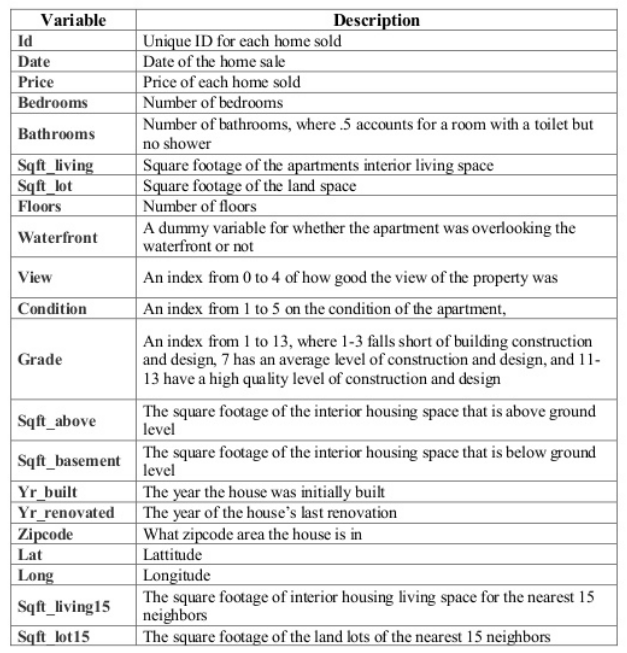


```python
df.hist(figsize=(20,20),bins=50)
```


    array([[<matplotlib.axes._subplots.AxesSubplot object at 0x0000022F0DA69430>,
            <matplotlib.axes._subplots.AxesSubplot object at 0x0000022F0E1448E0>,
            <matplotlib.axes._subplots.AxesSubplot object at 0x0000022F0E173D30>,
            <matplotlib.axes._subplots.AxesSubplot object at 0x0000022F0E1AC1C0>],
           [<matplotlib.axes._subplots.AxesSubplot object at 0x0000022F0E1D9610>,
            <matplotlib.axes._subplots.AxesSubplot object at 0x0000022F0E12A8E0>,
            <matplotlib.axes._subplots.AxesSubplot object at 0x0000022F0E181280>,
            <matplotlib.axes._subplots.AxesSubplot object at 0x0000022F0E236160>],
           [<matplotlib.axes._subplots.AxesSubplot object at 0x0000022F0E291970>,
            <matplotlib.axes._subplots.AxesSubplot object at 0x0000022F0E2BCDC0>,
            <matplotlib.axes._subplots.AxesSubplot object at 0x0000022F0E2F5280>,
            <matplotlib.axes._subplots.AxesSubplot object at 0x0000022F0E31F6D0>],
           [<matplotlib.axes._subplots.AxesSubplot object at 0x0000022F0E34CB20>,
            <matplotlib.axes._subplots.AxesSubplot object at 0x0000022F0E37AF70>,
            <matplotlib.axes._subplots.AxesSubplot object at 0x0000022F0E3B2400>,
            <matplotlib.axes._subplots.AxesSubplot object at 0x0000022F0E3DF880>]],
          dtype=object)


    
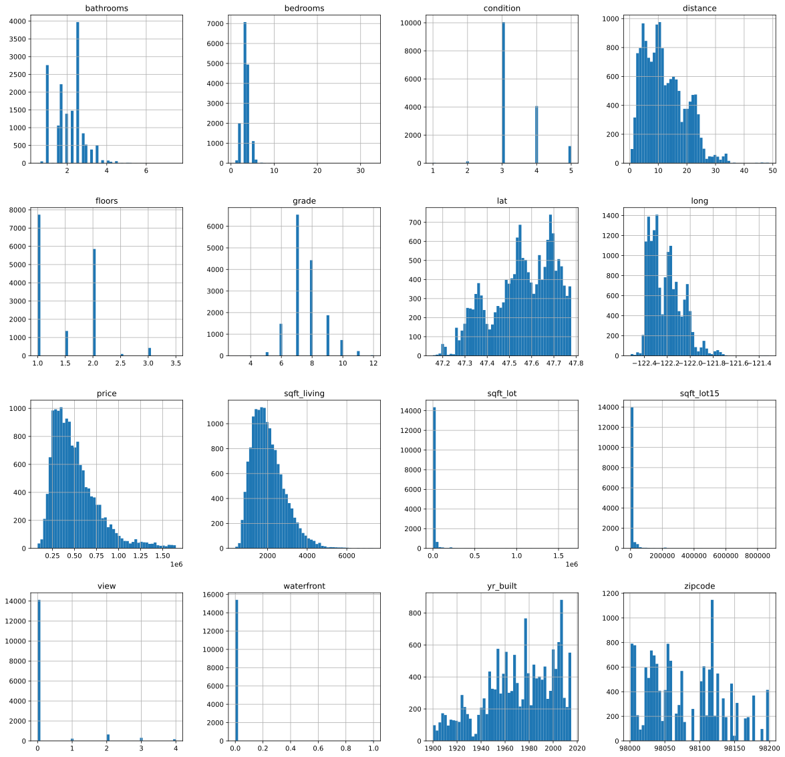
    


```python
df.describe() # a look at the data, data has been cleaned and imported
```


<div>
<style scoped>
    .dataframe tbody tr th:only-of-type {
        vertical-align: middle;
    }

    .dataframe tbody tr th {
        vertical-align: top;
    }

    .dataframe thead th {
        text-align: right;
    }
</style>
<table border="1" class="dataframe">
  <thead>
    <tr style="text-align: right;">
      <th></th>
      <th>price</th>
      <th>bedrooms</th>
      <th>bathrooms</th>
      <th>sqft_living</th>
      <th>sqft_lot</th>
      <th>floors</th>
      <th>waterfront</th>
      <th>view</th>
      <th>condition</th>
      <th>grade</th>
      <th>yr_built</th>
      <th>zipcode</th>
      <th>lat</th>
      <th>long</th>
      <th>sqft_lot15</th>
      <th>distance</th>
    </tr>
  </thead>
  <tbody>
    <tr>
      <th>count</th>
      <td>15480.00</td>
      <td>15480.00</td>
      <td>15480.00</td>
      <td>15480.00</td>
      <td>15480.00</td>
      <td>15480.00</td>
      <td>15480.00</td>
      <td>15480.00</td>
      <td>15480.00</td>
      <td>15480.00</td>
      <td>15480.00</td>
      <td>15480.00</td>
      <td>15480.00</td>
      <td>15480.00</td>
      <td>15480.00</td>
      <td>15480.00</td>
    </tr>
    <tr>
      <th>mean</th>
      <td>508430.96</td>
      <td>3.36</td>
      <td>2.09</td>
      <td>2037.26</td>
      <td>15073.20</td>
      <td>1.49</td>
      <td>0.00</td>
      <td>0.20</td>
      <td>3.41</td>
      <td>7.61</td>
      <td>1971.05</td>
      <td>98077.85</td>
      <td>47.56</td>
      <td>-122.21</td>
      <td>12791.54</td>
      <td>12.13</td>
    </tr>
    <tr>
      <th>std</th>
      <td>261518.09</td>
      <td>0.93</td>
      <td>0.73</td>
      <td>834.96</td>
      <td>41238.50</td>
      <td>0.54</td>
      <td>0.07</td>
      <td>0.71</td>
      <td>0.65</td>
      <td>1.11</td>
      <td>29.24</td>
      <td>53.31</td>
      <td>0.14</td>
      <td>0.14</td>
      <td>27915.59</td>
      <td>7.10</td>
    </tr>
    <tr>
      <th>min</th>
      <td>82000.00</td>
      <td>1.00</td>
      <td>0.50</td>
      <td>370.00</td>
      <td>520.00</td>
      <td>1.00</td>
      <td>0.00</td>
      <td>0.00</td>
      <td>1.00</td>
      <td>3.00</td>
      <td>1900.00</td>
      <td>98001.00</td>
      <td>47.16</td>
      <td>-122.52</td>
      <td>659.00</td>
      <td>0.36</td>
    </tr>
    <tr>
      <th>25%</th>
      <td>320000.00</td>
      <td>3.00</td>
      <td>1.50</td>
      <td>1420.00</td>
      <td>5012.75</td>
      <td>1.00</td>
      <td>0.00</td>
      <td>0.00</td>
      <td>3.00</td>
      <td>7.00</td>
      <td>1952.00</td>
      <td>98033.00</td>
      <td>47.47</td>
      <td>-122.33</td>
      <td>5100.00</td>
      <td>6.28</td>
    </tr>
    <tr>
      <th>50%</th>
      <td>449000.00</td>
      <td>3.00</td>
      <td>2.25</td>
      <td>1900.00</td>
      <td>7560.00</td>
      <td>1.50</td>
      <td>0.00</td>
      <td>0.00</td>
      <td>3.00</td>
      <td>7.00</td>
      <td>1975.00</td>
      <td>98065.00</td>
      <td>47.57</td>
      <td>-122.23</td>
      <td>7584.00</td>
      <td>10.78</td>
    </tr>
    <tr>
      <th>75%</th>
      <td>627500.00</td>
      <td>4.00</td>
      <td>2.50</td>
      <td>2510.00</td>
      <td>10500.00</td>
      <td>2.00</td>
      <td>0.00</td>
      <td>0.00</td>
      <td>4.00</td>
      <td>8.00</td>
      <td>1996.00</td>
      <td>98117.00</td>
      <td>47.68</td>
      <td>-122.12</td>
      <td>10014.50</td>
      <td>16.85</td>
    </tr>
    <tr>
      <th>max</th>
      <td>1650000.00</td>
      <td>33.00</td>
      <td>7.50</td>
      <td>7350.00</td>
      <td>1651359.00</td>
      <td>3.50</td>
      <td>1.00</td>
      <td>4.00</td>
      <td>5.00</td>
      <td>12.00</td>
      <td>2015.00</td>
      <td>98199.00</td>
      <td>47.78</td>
      <td>-121.31</td>
      <td>871200.00</td>
      <td>48.63</td>
    </tr>
  </tbody>
</table>
</div>


## Check for Multicollinearity in the data


```python
features = ['price','bedrooms','bathrooms','sqft_living','sqft_lot','sqft_lot15','floors','waterfront','view','condition','grade','yr_built','lat','long','distance']
```


```python
corr1 = df[features].corr()
corr1
# correlation table with target variable
```


<div>
<style scoped>
    .dataframe tbody tr th:only-of-type {
        vertical-align: middle;
    }

    .dataframe tbody tr th {
        vertical-align: top;
    }

    .dataframe thead th {
        text-align: right;
    }
</style>
<table border="1" class="dataframe">
  <thead>
    <tr style="text-align: right;">
      <th></th>
      <th>price</th>
      <th>bedrooms</th>
      <th>bathrooms</th>
      <th>sqft_living</th>
      <th>sqft_lot</th>
      <th>sqft_lot15</th>
      <th>floors</th>
      <th>waterfront</th>
      <th>view</th>
      <th>condition</th>
      <th>grade</th>
      <th>yr_built</th>
      <th>lat</th>
      <th>long</th>
      <th>distance</th>
    </tr>
  </thead>
  <tbody>
    <tr>
      <th>price</th>
      <td>1.00</td>
      <td>0.31</td>
      <td>0.50</td>
      <td>0.67</td>
      <td>0.09</td>
      <td>0.09</td>
      <td>0.28</td>
      <td>0.11</td>
      <td>0.32</td>
      <td>0.03</td>
      <td>0.67</td>
      <td>0.06</td>
      <td>0.39</td>
      <td>0.05</td>
      <td>-0.32</td>
    </tr>
    <tr>
      <th>bedrooms</th>
      <td>0.31</td>
      <td>1.00</td>
      <td>0.50</td>
      <td>0.58</td>
      <td>0.03</td>
      <td>0.02</td>
      <td>0.17</td>
      <td>-0.04</td>
      <td>0.05</td>
      <td>0.02</td>
      <td>0.34</td>
      <td>0.16</td>
      <td>-0.01</td>
      <td>0.14</td>
      <td>0.08</td>
    </tr>
    <tr>
      <th>bathrooms</th>
      <td>0.50</td>
      <td>0.50</td>
      <td>1.00</td>
      <td>0.73</td>
      <td>0.07</td>
      <td>0.08</td>
      <td>0.51</td>
      <td>0.00</td>
      <td>0.13</td>
      <td>-0.14</td>
      <td>0.64</td>
      <td>0.53</td>
      <td>0.02</td>
      <td>0.24</td>
      <td>0.11</td>
    </tr>
    <tr>
      <th>sqft_living</th>
      <td>0.67</td>
      <td>0.58</td>
      <td>0.73</td>
      <td>1.00</td>
      <td>0.16</td>
      <td>0.18</td>
      <td>0.35</td>
      <td>0.02</td>
      <td>0.22</td>
      <td>-0.07</td>
      <td>0.74</td>
      <td>0.34</td>
      <td>0.04</td>
      <td>0.27</td>
      <td>0.12</td>
    </tr>
    <tr>
      <th>sqft_lot</th>
      <td>0.09</td>
      <td>0.03</td>
      <td>0.07</td>
      <td>0.16</td>
      <td>1.00</td>
      <td>0.72</td>
      <td>-0.01</td>
      <td>0.03</td>
      <td>0.08</td>
      <td>-0.01</td>
      <td>0.10</td>
      <td>0.05</td>
      <td>-0.09</td>
      <td>0.23</td>
      <td>0.24</td>
    </tr>
    <tr>
      <th>sqft_lot15</th>
      <td>0.09</td>
      <td>0.02</td>
      <td>0.08</td>
      <td>0.18</td>
      <td>0.72</td>
      <td>1.00</td>
      <td>-0.02</td>
      <td>0.03</td>
      <td>0.07</td>
      <td>-0.00</td>
      <td>0.11</td>
      <td>0.07</td>
      <td>-0.09</td>
      <td>0.25</td>
      <td>0.27</td>
    </tr>
    <tr>
      <th>floors</th>
      <td>0.28</td>
      <td>0.17</td>
      <td>0.51</td>
      <td>0.35</td>
      <td>-0.01</td>
      <td>-0.02</td>
      <td>1.00</td>
      <td>-0.00</td>
      <td>0.00</td>
      <td>-0.27</td>
      <td>0.46</td>
      <td>0.50</td>
      <td>0.05</td>
      <td>0.13</td>
      <td>0.01</td>
    </tr>
    <tr>
      <th>waterfront</th>
      <td>0.11</td>
      <td>-0.04</td>
      <td>0.00</td>
      <td>0.02</td>
      <td>0.03</td>
      <td>0.03</td>
      <td>-0.00</td>
      <td>1.00</td>
      <td>0.33</td>
      <td>0.02</td>
      <td>0.01</td>
      <td>-0.04</td>
      <td>-0.03</td>
      <td>-0.06</td>
      <td>0.00</td>
    </tr>
    <tr>
      <th>view</th>
      <td>0.32</td>
      <td>0.05</td>
      <td>0.13</td>
      <td>0.22</td>
      <td>0.08</td>
      <td>0.07</td>
      <td>0.00</td>
      <td>0.33</td>
      <td>1.00</td>
      <td>0.04</td>
      <td>0.19</td>
      <td>-0.06</td>
      <td>-0.01</td>
      <td>-0.08</td>
      <td>-0.06</td>
    </tr>
    <tr>
      <th>condition</th>
      <td>0.03</td>
      <td>0.02</td>
      <td>-0.14</td>
      <td>-0.07</td>
      <td>-0.01</td>
      <td>-0.00</td>
      <td>-0.27</td>
      <td>0.02</td>
      <td>0.04</td>
      <td>1.00</td>
      <td>-0.16</td>
      <td>-0.36</td>
      <td>-0.02</td>
      <td>-0.10</td>
      <td>-0.07</td>
    </tr>
    <tr>
      <th>grade</th>
      <td>0.67</td>
      <td>0.34</td>
      <td>0.64</td>
      <td>0.74</td>
      <td>0.10</td>
      <td>0.11</td>
      <td>0.46</td>
      <td>0.01</td>
      <td>0.19</td>
      <td>-0.16</td>
      <td>1.00</td>
      <td>0.47</td>
      <td>0.11</td>
      <td>0.22</td>
      <td>0.04</td>
    </tr>
    <tr>
      <th>yr_built</th>
      <td>0.06</td>
      <td>0.16</td>
      <td>0.53</td>
      <td>0.34</td>
      <td>0.05</td>
      <td>0.07</td>
      <td>0.50</td>
      <td>-0.04</td>
      <td>-0.06</td>
      <td>-0.36</td>
      <td>0.47</td>
      <td>1.00</td>
      <td>-0.15</td>
      <td>0.41</td>
      <td>0.40</td>
    </tr>
    <tr>
      <th>lat</th>
      <td>0.39</td>
      <td>-0.01</td>
      <td>0.02</td>
      <td>0.04</td>
      <td>-0.09</td>
      <td>-0.09</td>
      <td>0.05</td>
      <td>-0.03</td>
      <td>-0.01</td>
      <td>-0.02</td>
      <td>0.11</td>
      <td>-0.15</td>
      <td>1.00</td>
      <td>-0.13</td>
      <td>-0.66</td>
    </tr>
    <tr>
      <th>long</th>
      <td>0.05</td>
      <td>0.14</td>
      <td>0.24</td>
      <td>0.27</td>
      <td>0.23</td>
      <td>0.25</td>
      <td>0.13</td>
      <td>-0.06</td>
      <td>-0.08</td>
      <td>-0.10</td>
      <td>0.22</td>
      <td>0.41</td>
      <td>-0.13</td>
      <td>1.00</td>
      <td>0.68</td>
    </tr>
    <tr>
      <th>distance</th>
      <td>-0.32</td>
      <td>0.08</td>
      <td>0.11</td>
      <td>0.12</td>
      <td>0.24</td>
      <td>0.27</td>
      <td>0.01</td>
      <td>0.00</td>
      <td>-0.06</td>
      <td>-0.07</td>
      <td>0.04</td>
      <td>0.40</td>
      <td>-0.66</td>
      <td>0.68</td>
      <td>1.00</td>
    </tr>
  </tbody>
</table>
</div>


```python
plt.figure(figsize=(10,8))
# cmap = sns.diverging_palette(300,10,as_cmap=True)
mask = np.triu(np.ones_like(corr1, dtype=bool))
chart = sns.heatmap(corr1, fmt='0.2f', mask=mask, annot=True, vmax=0.3, square=True, cbar_kws={"shrink": .5});
chart.set_xticklabels(chart.get_xticklabels(),rotation=45)
chart.set_yticklabels(chart.get_xticklabels(),rotation=25)
plt.title("Heat Map with Target",fontsize=20)
```


    Text(0.5, 1.0, 'Heat Map with Target')


    
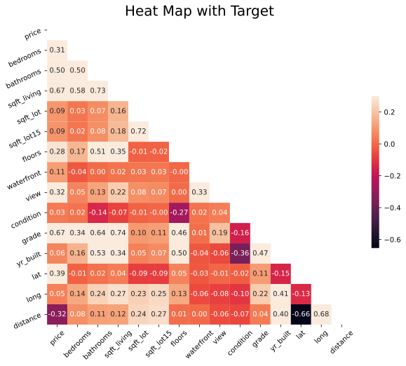
    


```python
features2 = ['bedrooms','bathrooms','sqft_living','sqft_lot','floors','waterfront','view','condition','grade','yr_built','lat','long','distance']
corr2 = df[features2].corr()
corr2
# correlation table with target variable
```


<div>
<style scoped>
    .dataframe tbody tr th:only-of-type {
        vertical-align: middle;
    }

    .dataframe tbody tr th {
        vertical-align: top;
    }

    .dataframe thead th {
        text-align: right;
    }
</style>
<table border="1" class="dataframe">
  <thead>
    <tr style="text-align: right;">
      <th></th>
      <th>bedrooms</th>
      <th>bathrooms</th>
      <th>sqft_living</th>
      <th>sqft_lot</th>
      <th>floors</th>
      <th>waterfront</th>
      <th>view</th>
      <th>condition</th>
      <th>grade</th>
      <th>yr_built</th>
      <th>lat</th>
      <th>long</th>
      <th>distance</th>
    </tr>
  </thead>
  <tbody>
    <tr>
      <th>bedrooms</th>
      <td>1.00</td>
      <td>0.50</td>
      <td>0.58</td>
      <td>0.03</td>
      <td>0.17</td>
      <td>-0.04</td>
      <td>0.05</td>
      <td>0.02</td>
      <td>0.34</td>
      <td>0.16</td>
      <td>-0.01</td>
      <td>0.14</td>
      <td>0.08</td>
    </tr>
    <tr>
      <th>bathrooms</th>
      <td>0.50</td>
      <td>1.00</td>
      <td>0.73</td>
      <td>0.07</td>
      <td>0.51</td>
      <td>0.00</td>
      <td>0.13</td>
      <td>-0.14</td>
      <td>0.64</td>
      <td>0.53</td>
      <td>0.02</td>
      <td>0.24</td>
      <td>0.11</td>
    </tr>
    <tr>
      <th>sqft_living</th>
      <td>0.58</td>
      <td>0.73</td>
      <td>1.00</td>
      <td>0.16</td>
      <td>0.35</td>
      <td>0.02</td>
      <td>0.22</td>
      <td>-0.07</td>
      <td>0.74</td>
      <td>0.34</td>
      <td>0.04</td>
      <td>0.27</td>
      <td>0.12</td>
    </tr>
    <tr>
      <th>sqft_lot</th>
      <td>0.03</td>
      <td>0.07</td>
      <td>0.16</td>
      <td>1.00</td>
      <td>-0.01</td>
      <td>0.03</td>
      <td>0.08</td>
      <td>-0.01</td>
      <td>0.10</td>
      <td>0.05</td>
      <td>-0.09</td>
      <td>0.23</td>
      <td>0.24</td>
    </tr>
    <tr>
      <th>floors</th>
      <td>0.17</td>
      <td>0.51</td>
      <td>0.35</td>
      <td>-0.01</td>
      <td>1.00</td>
      <td>-0.00</td>
      <td>0.00</td>
      <td>-0.27</td>
      <td>0.46</td>
      <td>0.50</td>
      <td>0.05</td>
      <td>0.13</td>
      <td>0.01</td>
    </tr>
    <tr>
      <th>waterfront</th>
      <td>-0.04</td>
      <td>0.00</td>
      <td>0.02</td>
      <td>0.03</td>
      <td>-0.00</td>
      <td>1.00</td>
      <td>0.33</td>
      <td>0.02</td>
      <td>0.01</td>
      <td>-0.04</td>
      <td>-0.03</td>
      <td>-0.06</td>
      <td>0.00</td>
    </tr>
    <tr>
      <th>view</th>
      <td>0.05</td>
      <td>0.13</td>
      <td>0.22</td>
      <td>0.08</td>
      <td>0.00</td>
      <td>0.33</td>
      <td>1.00</td>
      <td>0.04</td>
      <td>0.19</td>
      <td>-0.06</td>
      <td>-0.01</td>
      <td>-0.08</td>
      <td>-0.06</td>
    </tr>
    <tr>
      <th>condition</th>
      <td>0.02</td>
      <td>-0.14</td>
      <td>-0.07</td>
      <td>-0.01</td>
      <td>-0.27</td>
      <td>0.02</td>
      <td>0.04</td>
      <td>1.00</td>
      <td>-0.16</td>
      <td>-0.36</td>
      <td>-0.02</td>
      <td>-0.10</td>
      <td>-0.07</td>
    </tr>
    <tr>
      <th>grade</th>
      <td>0.34</td>
      <td>0.64</td>
      <td>0.74</td>
      <td>0.10</td>
      <td>0.46</td>
      <td>0.01</td>
      <td>0.19</td>
      <td>-0.16</td>
      <td>1.00</td>
      <td>0.47</td>
      <td>0.11</td>
      <td>0.22</td>
      <td>0.04</td>
    </tr>
    <tr>
      <th>yr_built</th>
      <td>0.16</td>
      <td>0.53</td>
      <td>0.34</td>
      <td>0.05</td>
      <td>0.50</td>
      <td>-0.04</td>
      <td>-0.06</td>
      <td>-0.36</td>
      <td>0.47</td>
      <td>1.00</td>
      <td>-0.15</td>
      <td>0.41</td>
      <td>0.40</td>
    </tr>
    <tr>
      <th>lat</th>
      <td>-0.01</td>
      <td>0.02</td>
      <td>0.04</td>
      <td>-0.09</td>
      <td>0.05</td>
      <td>-0.03</td>
      <td>-0.01</td>
      <td>-0.02</td>
      <td>0.11</td>
      <td>-0.15</td>
      <td>1.00</td>
      <td>-0.13</td>
      <td>-0.66</td>
    </tr>
    <tr>
      <th>long</th>
      <td>0.14</td>
      <td>0.24</td>
      <td>0.27</td>
      <td>0.23</td>
      <td>0.13</td>
      <td>-0.06</td>
      <td>-0.08</td>
      <td>-0.10</td>
      <td>0.22</td>
      <td>0.41</td>
      <td>-0.13</td>
      <td>1.00</td>
      <td>0.68</td>
    </tr>
    <tr>
      <th>distance</th>
      <td>0.08</td>
      <td>0.11</td>
      <td>0.12</td>
      <td>0.24</td>
      <td>0.01</td>
      <td>0.00</td>
      <td>-0.06</td>
      <td>-0.07</td>
      <td>0.04</td>
      <td>0.40</td>
      <td>-0.66</td>
      <td>0.68</td>
      <td>1.00</td>
    </tr>
  </tbody>
</table>
</div>


```python
plt.figure(figsize=(10,8))
# cmap = sns.diverging_palette(300,10,as_cmap=True)
mask = np.triu(np.ones_like(corr2, dtype=bool))
chart = sns.heatmap(corr2,fmt='0.3f', mask=mask, annot=True, vmax=0.3, square=True, cbar_kws={"shrink": .5});
chart.set_xticklabels(chart.get_xticklabels(),rotation=45)
chart.set_yticklabels(chart.get_xticklabels(),rotation=25)
plt.title("Heat Map without Target",fontsize=20)
```


    Text(0.5, 1.0, 'Heat Map without Target')


    
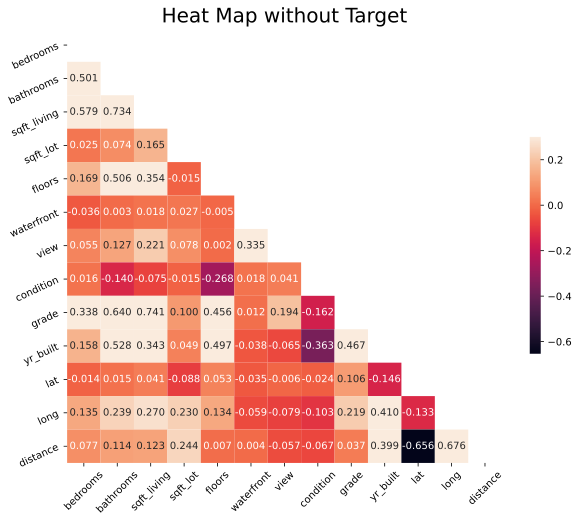
    


### Sqft_living and bathrooms are highly correlated, as are grade and sqft_living.
### Keeping in mind those two sets of highly correlated features, we can continue with creating our model and answering our questions!

### This next section will create a linear regression to model the data using a test/train split of 20/80. 


```python
# remove lat and long from here - will clearly be redundant since we feature engineered distance from Seattle (distance)
X = df[['bedrooms','bathrooms','sqft_living','sqft_lot15','floors','waterfront','view','condition','grade','distance']]
y = df['price']
X_train, X_test, y_train, y_test = train_test_split(X, y, test_size = .20, random_state = 20) # create test and train variables, assign random state for reproducibility
```


```python
reg = LinearRegression(fit_intercept=False) # create linear regression
reg.fit(X_train,y_train) # fit the model
```


    LinearRegression(fit_intercept=False)


```python
# evaluate the model on the testing data
a1 = reg.score(X_test, y_test)
X_train.shape
a1
```


    0.6851223744258852


```python
r2train = reg.score(X_train,y_train)
r2test = reg.score(X_test, y_test) 
num_obtrain = X_train.shape[0]
num_obtest = X_test.shape[0]
ptrain = X_train.shape[1]
ptest = X_test.shape[1]
```


```python
# compare the r2 scores of the model on the training and test data
r2tra, r2tes = reg.score(X_train,y_train),reg.score(X_test,y_test)
print(r2tra)
print(r2tes)

#a adjusted r^2 for the data is telling us that this model's features explain ~66% of the change in price
```

    0.6894476298240686
    0.6851223744258852
    


```python
# calc adjusted r squared and VIF score for training data
clc(r2tra,num_obtrain,ptrain) # low VIF score is good but we can probably reduce it by finding some multicollinearity in the model to remove!
```

    Adjusted R^2 is:  0.6891966378494658
    VIF score is:  3.217468411798136
    


    (3.217468411798136, 0.6891966378494658)


```python
# calc adjusted r squared and VIF score for test data
clc(r2tes,num_obtest,ptest) # same as above test data is giving us similar indicators
```

    Adjusted R^2 is:  0.6841017014094375
    VIF score is:  3.16557577062517
    


    (3.16557577062517, 0.6841017014094375)


```python
df['PredictedPrice'] = reg.predict(X) # create a column with a new predicted price to compare graphs of the models predictions vs. the actual prices of homes
```


```python
x_mean = df['price'].mean()
df.head()
df['PredictedPrice'].plot.kde(label='Predicted Price')
df['price'].plot.kde(label='Actual Price')
plt.axvline(x_mean, 0, 5,label='Actual Price Mean', c='r')
plt.legend()

# graph below shows that our model is missing some information and is anticipating a more normal distribution whereas the actual home sales are skewed towards the lower price range. 
# the distribution of home prices leans to and peaks to the left of the mean home price, indicating positive skewness in the actual home price sales. This is also why our predictive model
# peaks right at the actual price mean
```


    <matplotlib.legend.Legend at 0x22f10d02b50>


    
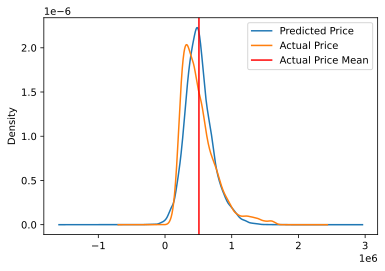
    


```python
# quick feature engineering of price per square foot - if we use this in a regression can't include price or sqft_living as features
df['$_sqft'] = df['price']/df['sqft_living']
df.head()
```


<div>
<style scoped>
    .dataframe tbody tr th:only-of-type {
        vertical-align: middle;
    }

    .dataframe tbody tr th {
        vertical-align: top;
    }

    .dataframe thead th {
        text-align: right;
    }
</style>
<table border="1" class="dataframe">
  <thead>
    <tr style="text-align: right;">
      <th></th>
      <th>price</th>
      <th>bedrooms</th>
      <th>bathrooms</th>
      <th>sqft_living</th>
      <th>sqft_lot</th>
      <th>floors</th>
      <th>waterfront</th>
      <th>view</th>
      <th>condition</th>
      <th>grade</th>
      <th>yr_built</th>
      <th>zipcode</th>
      <th>lat</th>
      <th>long</th>
      <th>sqft_lot15</th>
      <th>geo_loc</th>
      <th>distance</th>
      <th>PredictedPrice</th>
      <th>$_sqft</th>
    </tr>
  </thead>
  <tbody>
    <tr>
      <th>1</th>
      <td>538000.00</td>
      <td>3</td>
      <td>2.25</td>
      <td>2570</td>
      <td>7242</td>
      <td>2.00</td>
      <td>0.00</td>
      <td>0.00</td>
      <td>3</td>
      <td>7</td>
      <td>1951</td>
      <td>98125</td>
      <td>47.72</td>
      <td>-122.32</td>
      <td>7639</td>
      <td>(47.721, -122.319)</td>
      <td>7.01</td>
      <td>636495.58</td>
      <td>209.34</td>
    </tr>
    <tr>
      <th>3</th>
      <td>604000.00</td>
      <td>4</td>
      <td>3.00</td>
      <td>1960</td>
      <td>5000</td>
      <td>1.00</td>
      <td>0.00</td>
      <td>0.00</td>
      <td>5</td>
      <td>7</td>
      <td>1965</td>
      <td>98136</td>
      <td>47.52</td>
      <td>-122.39</td>
      <td>5000</td>
      <td>(47.521, -122.393)</td>
      <td>7.23</td>
      <td>532524.11</td>
      <td>308.16</td>
    </tr>
    <tr>
      <th>4</th>
      <td>510000.00</td>
      <td>3</td>
      <td>2.00</td>
      <td>1680</td>
      <td>8080</td>
      <td>1.00</td>
      <td>0.00</td>
      <td>0.00</td>
      <td>3</td>
      <td>8</td>
      <td>1987</td>
      <td>98074</td>
      <td>47.62</td>
      <td>-122.05</td>
      <td>7503</td>
      <td>(47.617, -122.045)</td>
      <td>14.29</td>
      <td>435320.19</td>
      <td>303.57</td>
    </tr>
    <tr>
      <th>5</th>
      <td>1230000.00</td>
      <td>4</td>
      <td>4.50</td>
      <td>5420</td>
      <td>101930</td>
      <td>1.00</td>
      <td>0.00</td>
      <td>0.00</td>
      <td>3</td>
      <td>11</td>
      <td>2001</td>
      <td>98053</td>
      <td>47.66</td>
      <td>-122.00</td>
      <td>101930</td>
      <td>(47.656, -122.005)</td>
      <td>16.31</td>
      <td>1235577.25</td>
      <td>226.94</td>
    </tr>
    <tr>
      <th>6</th>
      <td>257500.00</td>
      <td>3</td>
      <td>2.25</td>
      <td>1715</td>
      <td>6819</td>
      <td>2.00</td>
      <td>0.00</td>
      <td>0.00</td>
      <td>3</td>
      <td>7</td>
      <td>1995</td>
      <td>98003</td>
      <td>47.31</td>
      <td>-122.33</td>
      <td>6819</td>
      <td>(47.31, -122.327)</td>
      <td>21.58</td>
      <td>265123.53</td>
      <td>150.15</td>
    </tr>
  </tbody>
</table>
</div>


```python
# what can we remove from the model?

for column in ['price','bedrooms','bathrooms','sqft_living','sqft_lot','sqft_lot15','floors','waterfront','view','condition','grade','yr_built','lat','long','distance','$_sqft']:
    df[column].plot.hist(density = True, bins = 30, alpha=.85)
    df[column].plot.kde()
    plt.title(column)
    plt.legend()
    plt.show()

```


    
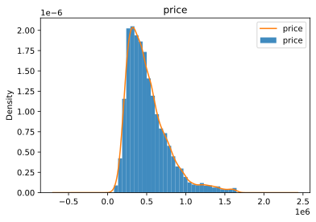
    


    
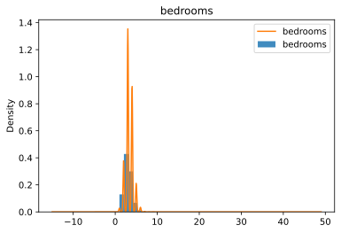
    


    
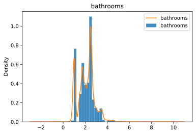
    


    
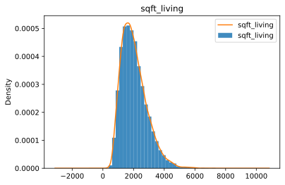
    


    
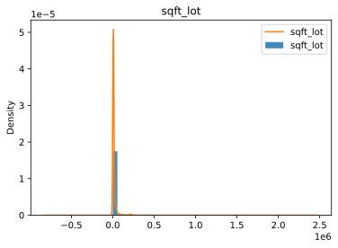
    


    
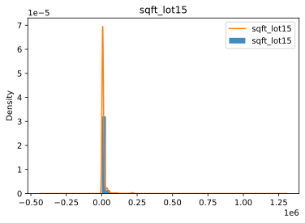
    


    
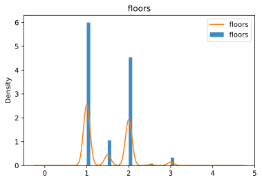
    


    
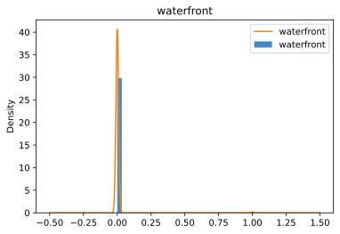
    


    
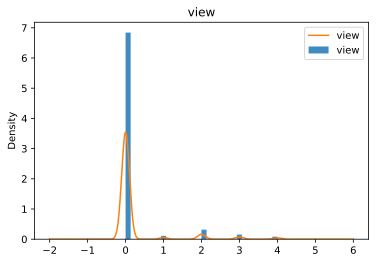
    


    
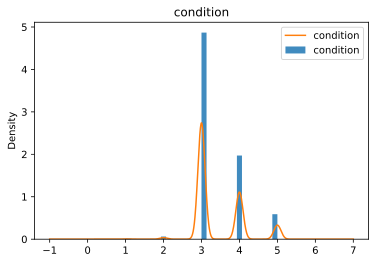
    


    
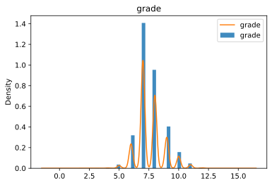
    


    
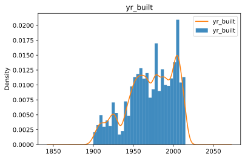
    


    
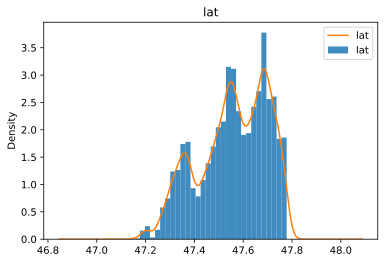
    


    
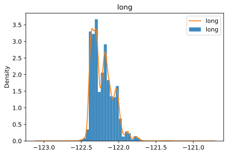
    


    
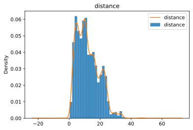
    


    
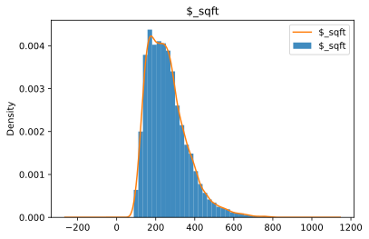
    


### In the above graphs we can see similarity in the shape of latitude histogram as well as year built. This means that as year built increases so does how far north the home was built. This implies multicollinearity between these two features and for a final predictive model one or both will need to be removed. Let's look at a coefficient table for the data. 


```python
# continue to develop the model 
# sqft_lot15 is going to represent the lots around the property
y_target = 'price'
formula = 'price~bedrooms+bathrooms+sqft_living+sqft_lot15+floors+waterfront+view+condition+grade+yr_built+distance-1'
lm = ols(formula=formula, data=df).fit()
```


```python
print(lm.summary())
```

                                     OLS Regression Results                                
    =======================================================================================
    Dep. Variable:                  price   R-squared (uncentered):                   0.938
    Model:                            OLS   Adj. R-squared (uncentered):              0.938
    Method:                 Least Squares   F-statistic:                          2.128e+04
    Date:                Mon, 19 Oct 2020   Prob (F-statistic):                        0.00
    Time:                        11:09:51   Log-Likelihood:                     -2.0565e+05
    No. Observations:               15480   AIC:                                  4.113e+05
    Df Residuals:                   15469   BIC:                                  4.114e+05
    Df Model:                          11                                                  
    Covariance Type:            nonrobust                                                  
    ===============================================================================
                      coef    std err          t      P>|t|      [0.025      0.975]
    -------------------------------------------------------------------------------
    bedrooms    -1.305e+04   1575.988     -8.279      0.000   -1.61e+04   -9959.186
    bathrooms    4529.5018   2555.053      1.773      0.076    -478.703    9537.706
    sqft_living   136.5889      2.700     50.589      0.000     131.297     141.881
    sqft_lot15      0.5819      0.044     13.369      0.000       0.497       0.667
    floors      -1658.3807   2635.354     -0.629      0.529   -6823.984    3507.222
    waterfront    2.31e+05   1.82e+04     12.720      0.000    1.95e+05    2.67e+05
    view         3.896e+04   1792.143     21.742      0.000    3.55e+04    4.25e+04
    condition    3.737e+04   1804.636     20.710      0.000    3.38e+04    4.09e+04
    grade        8.831e+04   1698.403     51.998      0.000     8.5e+04    9.16e+04
    yr_built     -192.1698      6.855    -28.034      0.000    -205.606    -178.733
    distance    -1.406e+04    172.466    -81.551      0.000   -1.44e+04   -1.37e+04
    ==============================================================================
    Omnibus:                     2830.898   Durbin-Watson:                   1.972
    Prob(Omnibus):                  0.000   Jarque-Bera (JB):             8853.815
    Skew:                           0.940   Prob(JB):                         0.00
    Kurtosis:                       6.192   Cond. No.                     4.88e+05
    ==============================================================================
    
    Warnings:
    [1] Standard Errors assume that the covariance matrix of the errors is correctly specified.
    [2] The condition number is large, 4.88e+05. This might indicate that there are
    strong multicollinearity or other numerical problems.
    


```python
# Let's repeat this analysis by addressing features with a high likelihookd of multicollinearity. Sqft_living and number of floors are probably correlated, so I will test the model and remove either while keeping the rest of the model the same in order to see which one is contributing to the model the most and keep that one (floors also has a high p-value and is not statistically significant). Bathrooms also has a high p value, and is likely not statistically significant. 
```


```python
y_target = 'price'
formula = 'price~bedrooms+sqft_living+sqft_lot15+waterfront+view+condition+grade+yr_built+distance-1'
lm = ols(formula=formula, data=df).fit()
```


```python
print(lm.summary())
```

                                     OLS Regression Results                                
    =======================================================================================
    Dep. Variable:                  price   R-squared (uncentered):                   0.938
    Model:                            OLS   Adj. R-squared (uncentered):              0.938
    Method:                 Least Squares   F-statistic:                          2.601e+04
    Date:                Mon, 19 Oct 2020   Prob (F-statistic):                        0.00
    Time:                        11:09:51   Log-Likelihood:                     -2.0565e+05
    No. Observations:               15480   AIC:                                  4.113e+05
    Df Residuals:                   15471   BIC:                                  4.114e+05
    Df Model:                           9                                                  
    Covariance Type:            nonrobust                                                  
    ===============================================================================
                      coef    std err          t      P>|t|      [0.025      0.975]
    -------------------------------------------------------------------------------
    bedrooms    -1.257e+04   1552.612     -8.095      0.000   -1.56e+04   -9525.414
    sqft_living   138.5070      2.464     56.215      0.000     133.678     143.336
    sqft_lot15      0.5782      0.043     13.334      0.000       0.493       0.663
    waterfront    2.31e+05   1.82e+04     12.725      0.000    1.95e+05    2.67e+05
    view         3.896e+04   1785.078     21.824      0.000    3.55e+04    4.25e+04
    condition    3.723e+04   1747.861     21.303      0.000    3.38e+04    4.07e+04
    grade        8.861e+04   1641.762     53.974      0.000    8.54e+04    9.18e+04
    yr_built     -192.4194      6.778    -28.389      0.000    -205.705    -179.134
    distance    -1.404e+04    171.979    -81.664      0.000   -1.44e+04   -1.37e+04
    ==============================================================================
    Omnibus:                     2830.756   Durbin-Watson:                   1.972
    Prob(Omnibus):                  0.000   Jarque-Bera (JB):             8853.903
    Skew:                           0.940   Prob(JB):                         0.00
    Kurtosis:                       6.192   Cond. No.                     4.88e+05
    ==============================================================================
    
    Warnings:
    [1] Standard Errors assume that the covariance matrix of the errors is correctly specified.
    [2] The condition number is large, 4.88e+05. This might indicate that there are
    strong multicollinearity or other numerical problems.
    


```python
y_target = 'price'
formula = 'price~bedrooms+sqft_living+sqft_lot15+waterfront+view+condition+grade+distance-1' # remove year built
X = ['price','bedrooms','sqft_living','sqft_lot15','waterfront','view','condition','grade','distance'] 
lm = ols(formula=formula, data=df).fit()
```


```python
print(lm.summary())
```

                                     OLS Regression Results                                
    =======================================================================================
    Dep. Variable:                  price   R-squared (uncentered):                   0.935
    Model:                            OLS   Adj. R-squared (uncentered):              0.935
    Method:                 Least Squares   F-statistic:                          2.772e+04
    Date:                Mon, 19 Oct 2020   Prob (F-statistic):                        0.00
    Time:                        11:09:51   Log-Likelihood:                     -2.0604e+05
    No. Observations:               15480   AIC:                                  4.121e+05
    Df Residuals:                   15472   BIC:                                  4.122e+05
    Df Model:                           8                                                  
    Covariance Type:            nonrobust                                                  
    ===============================================================================
                      coef    std err          t      P>|t|      [0.025      0.975]
    -------------------------------------------------------------------------------
    bedrooms     -2.66e+04   1509.610    -17.622      0.000   -2.96e+04   -2.36e+04
    sqft_living   173.7200      2.184     79.558      0.000     169.440     178.000
    sqft_lot15      0.5894      0.044     13.253      0.000       0.502       0.677
    waterfront   2.172e+05   1.86e+04     11.668      0.000    1.81e+05    2.54e+05
    view         4.251e+04   1826.415     23.276      0.000    3.89e+04    4.61e+04
    condition    9590.4387   1488.772      6.442      0.000    6672.270    1.25e+04
    grade        5.029e+04    958.474     52.469      0.000    4.84e+04    5.22e+04
    distance    -1.535e+04    170.000    -90.279      0.000   -1.57e+04    -1.5e+04
    ==============================================================================
    Omnibus:                     2922.542   Durbin-Watson:                   1.970
    Prob(Omnibus):                  0.000   Jarque-Bera (JB):             9177.120
    Skew:                           0.968   Prob(JB):                         0.00
    Kurtosis:                       6.237   Cond. No.                     4.87e+05
    ==============================================================================
    
    Warnings:
    [1] Standard Errors assume that the covariance matrix of the errors is correctly specified.
    [2] The condition number is large, 4.87e+05. This might indicate that there are
    strong multicollinearity or other numerical problems.
    

### Regression output analysis for model.
#### For each of the above OLS Regression outputs we can reject the Jarque Bera null hypothesis and conclude that the distribution is non-normal. 
#### Additionally, we can see that our adjusted R^2 indicates for all regressions that our model is accounting for most (likely too much, or overfitting) of the variation in the dependent variable (price). 
#### Durbin-Watson test around 2 indicates that there is neither positive autocorrelation nor negative autocorrelation present in the model. 


```python
df = df[df['bedrooms']<30] # remove the large large high bedroom home from the dataset. homes above 3 standard deviations of the price of the mean have already been removed from the dataset
```


```python
for column in ['bedrooms','sqft_living','sqft_lot15','waterfront','view','condition','grade','distance']:
    sns.jointplot(x = column, y ='price', data = df, kind = 'reg', label = column, joint_kws = {'line_kws':{'color':'chartreuse'}})
    plt.legend()
    plt.show()

# remove single 30+ bedroom home from data
```


    

    


    

    


    

    


    

    


    

    


    

    


    

    


    

    


```python
# Waterfront is a binary distribution and very few homes in the dataset are on the waterfront anyway.
# Remove waterfront from the reg model
# Remove condition from the reg model, flat line/no correlation to price
# Removed gigantic 30+ bedroom house from the data set.
```


```python
y_target = 'price'
formula = 'price~bedrooms+sqft_living+sqft_lot15+view+grade+distance-1'
lm = ols(formula=formula, data=df).fit()
```


```python
print(lm.summary()) # fit to the data
```

                                     OLS Regression Results                                
    =======================================================================================
    Dep. Variable:                  price   R-squared (uncentered):                   0.934
    Model:                            OLS   Adj. R-squared (uncentered):              0.934
    Method:                 Least Squares   F-statistic:                          3.659e+04
    Date:                Mon, 19 Oct 2020   Prob (F-statistic):                        0.00
    Time:                        11:10:19   Log-Likelihood:                     -2.0610e+05
    No. Observations:               15479   AIC:                                  4.122e+05
    Df Residuals:                   15473   BIC:                                  4.123e+05
    Df Model:                           6                                                  
    Covariance Type:            nonrobust                                                  
    ===============================================================================
                      coef    std err          t      P>|t|      [0.025      0.975]
    -------------------------------------------------------------------------------
    bedrooms     -2.64e+04   1503.098    -17.565      0.000   -2.93e+04   -2.35e+04
    sqft_living   168.6491      2.033     82.961      0.000     164.664     172.634
    sqft_lot15      0.5922      0.045     13.254      0.000       0.505       0.680
    view         4.992e+04   1727.088     28.906      0.000    4.65e+04    5.33e+04
    grade        5.538e+04    720.191     76.893      0.000     5.4e+04    5.68e+04
    distance    -1.515e+04    170.442    -88.908      0.000   -1.55e+04   -1.48e+04
    ==============================================================================
    Omnibus:                     2930.596   Durbin-Watson:                   1.971
    Prob(Omnibus):                  0.000   Jarque-Bera (JB):             9163.325
    Skew:                           0.972   Prob(JB):                         0.00
    Kurtosis:                       6.229   Cond. No.                     4.58e+04
    ==============================================================================
    
    Warnings:
    [1] Standard Errors assume that the covariance matrix of the errors is correctly specified.
    [2] The condition number is large, 4.58e+04. This might indicate that there are
    strong multicollinearity or other numerical problems.
    


```python
cm(df,['bedrooms', 'sqft_living', 'sqft_lot15','view','grade','distance'],'price',add_constant=False,show_summary=True,vif_threshold=3.5) # cm is check model function from statsFunctions.py
```

    bedrooms surpassed threshold with vif=19.64880112008724
    sqft_living surpassed threshold with vif=14.403396641134645
    grade surpassed threshold with vif=22.07347655102637
    distance surpassed threshold with vif=4.124077291265315
    Model contains multicollinear features
                                     OLS Regression Results                                
    =======================================================================================
    Dep. Variable:                  price   R-squared (uncentered):                   0.934
    Model:                            OLS   Adj. R-squared (uncentered):              0.934
    Method:                 Least Squares   F-statistic:                          3.659e+04
    Date:                Mon, 19 Oct 2020   Prob (F-statistic):                        0.00
    Time:                        11:10:19   Log-Likelihood:                     -2.0610e+05
    No. Observations:               15479   AIC:                                  4.122e+05
    Df Residuals:                   15473   BIC:                                  4.123e+05
    Df Model:                           6                                                  
    Covariance Type:            nonrobust                                                  
    ===============================================================================
                      coef    std err          t      P>|t|      [0.025      0.975]
    -------------------------------------------------------------------------------
    bedrooms     -2.64e+04   1503.098    -17.565      0.000   -2.93e+04   -2.35e+04
    sqft_living   168.6491      2.033     82.961      0.000     164.664     172.634
    sqft_lot15      0.5922      0.045     13.254      0.000       0.505       0.680
    view         4.992e+04   1727.088     28.906      0.000    4.65e+04    5.33e+04
    grade        5.538e+04    720.191     76.893      0.000     5.4e+04    5.68e+04
    distance    -1.515e+04    170.442    -88.908      0.000   -1.55e+04   -1.48e+04
    ==============================================================================
    Omnibus:                     2930.596   Durbin-Watson:                   1.971
    Prob(Omnibus):                  0.000   Jarque-Bera (JB):             9163.325
    Skew:                           0.972   Prob(JB):                         0.00
    Kurtosis:                       6.229   Cond. No.                     4.58e+04
    ==============================================================================
    
    Warnings:
    [1] Standard Errors assume that the covariance matrix of the errors is correctly specified.
    [2] The condition number is large, 4.58e+04. This might indicate that there are
    strong multicollinearity or other numerical problems.
    Residuals failed test/tests
    


    <statsmodels.regression.linear_model.RegressionResultsWrapper at 0x22f11547a00>


```python
# remove grade from model and recheck (high VIF scores)
y_target = 'price'
formula = 'price~bedrooms+sqft_living+sqft_lot15+view+distance-1'
lm = ols(formula=formula, data=df).fit()
```


```python
print(lm.summary()) 
```

                                     OLS Regression Results                                
    =======================================================================================
    Dep. Variable:                  price   R-squared (uncentered):                   0.909
    Model:                            OLS   Adj. R-squared (uncentered):              0.909
    Method:                 Least Squares   F-statistic:                          3.092e+04
    Date:                Mon, 19 Oct 2020   Prob (F-statistic):                        0.00
    Time:                        11:10:19   Log-Likelihood:                     -2.0861e+05
    No. Observations:               15479   AIC:                                  4.172e+05
    Df Residuals:                   15474   BIC:                                  4.173e+05
    Df Model:                           5                                                  
    Covariance Type:            nonrobust                                                  
    ===============================================================================
                      coef    std err          t      P>|t|      [0.025      0.975]
    -------------------------------------------------------------------------------
    bedrooms     4.171e+04   1427.557     29.220      0.000    3.89e+04    4.45e+04
    sqft_living   232.4534      2.182    106.548      0.000     228.177     236.730
    sqft_lot15      0.5104      0.053      9.719      0.000       0.407       0.613
    view         5.542e+04   2028.625     27.317      0.000    5.14e+04    5.94e+04
    distance    -1.161e+04    192.899    -60.177      0.000    -1.2e+04   -1.12e+04
    ==============================================================================
    Omnibus:                     1004.663   Durbin-Watson:                   1.951
    Prob(Omnibus):                  0.000   Jarque-Bera (JB):             3327.768
    Skew:                           0.290   Prob(JB):                         0.00
    Kurtosis:                       5.196   Cond. No.                     4.51e+04
    ==============================================================================
    
    Warnings:
    [1] Standard Errors assume that the covariance matrix of the errors is correctly specified.
    [2] The condition number is large, 4.51e+04. This might indicate that there are
    strong multicollinearity or other numerical problems.
    


```python
cm(df,['bedrooms', 'sqft_living', 'sqft_lot15', 'view', 'distance'],'price',add_constant=False,show_summary=True,vif_threshold=3.5) # cm is check model function from statsFunctions.py
# lets also remove bedrooms (double other features VIF scores)
```

    bedrooms surpassed threshold with vif=12.824201566498408
    sqft_living surpassed threshold with vif=12.0036147073731
    distance surpassed threshold with vif=3.822219717502709
    Model contains multicollinear features
                                     OLS Regression Results                                
    =======================================================================================
    Dep. Variable:                  price   R-squared (uncentered):                   0.909
    Model:                            OLS   Adj. R-squared (uncentered):              0.909
    Method:                 Least Squares   F-statistic:                          3.092e+04
    Date:                Mon, 19 Oct 2020   Prob (F-statistic):                        0.00
    Time:                        11:10:19   Log-Likelihood:                     -2.0861e+05
    No. Observations:               15479   AIC:                                  4.172e+05
    Df Residuals:                   15474   BIC:                                  4.173e+05
    Df Model:                           5                                                  
    Covariance Type:            nonrobust                                                  
    ===============================================================================
                      coef    std err          t      P>|t|      [0.025      0.975]
    -------------------------------------------------------------------------------
    bedrooms     4.171e+04   1427.557     29.220      0.000    3.89e+04    4.45e+04
    sqft_living   232.4534      2.182    106.548      0.000     228.177     236.730
    sqft_lot15      0.5104      0.053      9.719      0.000       0.407       0.613
    view         5.542e+04   2028.625     27.317      0.000    5.14e+04    5.94e+04
    distance    -1.161e+04    192.899    -60.177      0.000    -1.2e+04   -1.12e+04
    ==============================================================================
    Omnibus:                     1004.663   Durbin-Watson:                   1.951
    Prob(Omnibus):                  0.000   Jarque-Bera (JB):             3327.768
    Skew:                           0.290   Prob(JB):                         0.00
    Kurtosis:                       5.196   Cond. No.                     4.51e+04
    ==============================================================================
    
    Warnings:
    [1] Standard Errors assume that the covariance matrix of the errors is correctly specified.
    [2] The condition number is large, 4.51e+04. This might indicate that there are
    strong multicollinearity or other numerical problems.
    Residuals failed test/tests
    


    <statsmodels.regression.linear_model.RegressionResultsWrapper at 0x22f0eb858e0>


```python
cm(df,['sqft_living', 'sqft_lot15', 'view', 'distance'],'price',add_constant=False,show_summary=True,vif_threshold=3.5) # cm is check model function from statsFunctions.py
```

                                     OLS Regression Results                                
    =======================================================================================
    Dep. Variable:                  price   R-squared (uncentered):                   0.904
    Model:                            OLS   Adj. R-squared (uncentered):              0.904
    Method:                 Least Squares   F-statistic:                          3.642e+04
    Date:                Mon, 19 Oct 2020   Prob (F-statistic):                        0.00
    Time:                        11:10:19   Log-Likelihood:                     -2.0902e+05
    No. Observations:               15479   AIC:                                  4.181e+05
    Df Residuals:                   15475   BIC:                                  4.181e+05
    Df Model:                           4                                                  
    Covariance Type:            nonrobust                                                  
    ===============================================================================
                      coef    std err          t      P>|t|      [0.025      0.975]
    -------------------------------------------------------------------------------
    sqft_living   286.4363      1.192    240.303      0.000     284.100     288.773
    sqft_lot15      0.2755      0.053      5.168      0.000       0.171       0.380
    view         4.991e+04   2074.763     24.056      0.000    4.58e+04     5.4e+04
    distance    -9534.1252    184.243    -51.748      0.000   -9895.263   -9172.987
    ==============================================================================
    Omnibus:                      831.658   Durbin-Watson:                   1.926
    Prob(Omnibus):                  0.000   Jarque-Bera (JB):             3103.675
    Skew:                           0.128   Prob(JB):                         0.00
    Kurtosis:                       5.179   Cond. No.                     4.48e+04
    ==============================================================================
    
    Warnings:
    [1] Standard Errors assume that the covariance matrix of the errors is correctly specified.
    [2] The condition number is large, 4.48e+04. This might indicate that there are
    strong multicollinearity or other numerical problems.
    Residuals failed test/tests
    


    <statsmodels.regression.linear_model.RegressionResultsWrapper at 0x22f12876fa0>


```python
cm(df,['sqft_living','view', 'distance'],'price',add_constant=False,show_summary=True,vif_threshold=3.5) # cm is check model function from statsFunctions.py
# remove condition
```

                                     OLS Regression Results                                
    =======================================================================================
    Dep. Variable:                  price   R-squared (uncentered):                   0.904
    Model:                            OLS   Adj. R-squared (uncentered):              0.904
    Method:                 Least Squares   F-statistic:                          4.848e+04
    Date:                Mon, 19 Oct 2020   Prob (F-statistic):                        0.00
    Time:                        11:10:19   Log-Likelihood:                     -2.0904e+05
    No. Observations:               15479   AIC:                                  4.181e+05
    Df Residuals:                   15476   BIC:                                  4.181e+05
    Df Model:                           3                                                  
    Covariance Type:            nonrobust                                                  
    ===============================================================================
                      coef    std err          t      P>|t|      [0.025      0.975]
    -------------------------------------------------------------------------------
    sqft_living   286.9358      1.189    241.317      0.000     284.605     289.266
    view         5.056e+04   2072.629     24.395      0.000    4.65e+04    5.46e+04
    distance    -9315.7122    179.479    -51.904      0.000   -9667.513   -8963.911
    ==============================================================================
    Omnibus:                      829.237   Durbin-Watson:                   1.927
    Prob(Omnibus):                  0.000   Jarque-Bera (JB):             3056.391
    Skew:                           0.136   Prob(JB):                         0.00
    Kurtosis:                       5.160   Cond. No.                     3.20e+03
    ==============================================================================
    
    Warnings:
    [1] Standard Errors assume that the covariance matrix of the errors is correctly specified.
    [2] The condition number is large, 3.2e+03. This might indicate that there are
    strong multicollinearity or other numerical problems.
    Residuals failed test/tests
    


    <statsmodels.regression.linear_model.RegressionResultsWrapper at 0x22f10d937f0>


```python
cm(df,['sqft_living','sqft_lot15', 'distance'],'price',add_constant=False,show_summary=True,vif_threshold=3.5) # cm is check model function from statsFunctions.py
# remove condition
```

                                     OLS Regression Results                                
    =======================================================================================
    Dep. Variable:                  price   R-squared (uncentered):                   0.900
    Model:                            OLS   Adj. R-squared (uncentered):              0.900
    Method:                 Least Squares   F-statistic:                          4.663e+04
    Date:                Mon, 19 Oct 2020   Prob (F-statistic):                        0.00
    Time:                        11:10:19   Log-Likelihood:                     -2.0931e+05
    No. Observations:               15479   AIC:                                  4.186e+05
    Df Residuals:                   15476   BIC:                                  4.186e+05
    Df Model:                           3                                                  
    Covariance Type:            nonrobust                                                  
    ===============================================================================
                      coef    std err          t      P>|t|      [0.025      0.975]
    -------------------------------------------------------------------------------
    sqft_living   294.6556      1.163    253.342      0.000     292.376     296.935
    sqft_lot15      0.3536      0.054      6.525      0.000       0.247       0.460
    distance    -1.012e+04    185.982    -54.434      0.000   -1.05e+04   -9759.231
    ==============================================================================
    Omnibus:                      944.168   Durbin-Watson:                   1.928
    Prob(Omnibus):                  0.000   Jarque-Bera (JB):             3217.515
    Skew:                           0.249   Prob(JB):                         0.00
    Kurtosis:                       5.177   Cond. No.                     3.94e+03
    ==============================================================================
    
    Warnings:
    [1] Standard Errors assume that the covariance matrix of the errors is correctly specified.
    [2] The condition number is large, 3.94e+03. This might indicate that there are
    strong multicollinearity or other numerical problems.
    Residuals failed test/tests
    


    <statsmodels.regression.linear_model.RegressionResultsWrapper at 0x22f10d43fa0>


```python
cm(df,['sqft_living', 'view'],'price',add_constant=False,show_summary=True,vif_threshold=3.5) # cm is check model function from statsFunctions.py
```

                                     OLS Regression Results                                
    =======================================================================================
    Dep. Variable:                  price   R-squared (uncentered):                   0.887
    Model:                            OLS   Adj. R-squared (uncentered):              0.887
    Method:                 Least Squares   F-statistic:                          6.079e+04
    Date:                Mon, 19 Oct 2020   Prob (F-statistic):                        0.00
    Time:                        11:10:19   Log-Likelihood:                     -2.1028e+05
    No. Observations:               15479   AIC:                                  4.206e+05
    Df Residuals:                   15477   BIC:                                  4.206e+05
    Df Model:                           2                                                  
    Covariance Type:            nonrobust                                                  
    ===============================================================================
                      coef    std err          t      P>|t|      [0.025      0.975]
    -------------------------------------------------------------------------------
    sqft_living   236.5802      0.745    317.614      0.000     235.120     238.040
    view         6.375e+04   2228.793     28.602      0.000    5.94e+04    6.81e+04
    ==============================================================================
    Omnibus:                     1360.587   Durbin-Watson:                   1.959
    Prob(Omnibus):                  0.000   Jarque-Bera (JB):             2779.417
    Skew:                           0.582   Prob(JB):                         0.00
    Kurtosis:                       4.719   Cond. No.                     3.18e+03
    ==============================================================================
    
    Warnings:
    [1] Standard Errors assume that the covariance matrix of the errors is correctly specified.
    [2] The condition number is large, 3.18e+03. This might indicate that there are
    strong multicollinearity or other numerical problems.
    Residuals failed test/tests
    


    <statsmodels.regression.linear_model.RegressionResultsWrapper at 0x22f10d911f0>


```python
cm(df,['sqft_living', 'distance'],'price',add_constant=False,show_summary=True,vif_threshold=3.5) # cm is check model function from statsFunctions.py
```

                                     OLS Regression Results                                
    =======================================================================================
    Dep. Variable:                  price   R-squared (uncentered):                   0.900
    Model:                            OLS   Adj. R-squared (uncentered):              0.900
    Method:                 Least Squares   F-statistic:                          6.974e+04
    Date:                Mon, 19 Oct 2020   Prob (F-statistic):                        0.00
    Time:                        11:10:19   Log-Likelihood:                     -2.0933e+05
    No. Observations:               15479   AIC:                                  4.187e+05
    Df Residuals:                   15477   BIC:                                  4.187e+05
    Df Model:                           2                                                  
    Covariance Type:            nonrobust                                                  
    ===============================================================================
                      coef    std err          t      P>|t|      [0.025      0.975]
    -------------------------------------------------------------------------------
    sqft_living   295.4378      1.158    255.032      0.000     293.167     297.708
    distance    -9852.3292    181.513    -54.279      0.000   -1.02e+04   -9496.542
    ==============================================================================
    Omnibus:                      947.081   Durbin-Watson:                   1.929
    Prob(Omnibus):                  0.000   Jarque-Bera (JB):             3148.574
    Skew:                           0.261   Prob(JB):                         0.00
    Kurtosis:                       5.147   Cond. No.                         275.
    ==============================================================================
    
    Warnings:
    [1] Standard Errors assume that the covariance matrix of the errors is correctly specified.
    Residuals failed test/tests
    


    <statsmodels.regression.linear_model.RegressionResultsWrapper at 0x22f10e184f0>


```python
# lets look at residuals
```


```python
# time to redo the training and testing of our variables after having eliminated some features as a result of multicollinearity or high VIF scores.
X = df[['sqft_living','distance']]
y = df['price']
X_train, X_test, y_train, y_test = train_test_split(X, y, test_size = .20, random_state = 20) # create test and train variables, assign random state for reproducibility
```


```python
reg = LinearRegression(fit_intercept=False) # create linear regression
reg.fit(X_train,y_train) # fit the model
```


    LinearRegression(fit_intercept=False)


```python
# evaluate the model on the testing data
a1 = reg.score(X_test, y_test)
X_train.shape
a1 # R^2
```


    0.5008896889890428


```python
r2train = reg.score(X_train, y_train)
r2test = reg.score(X_test, y_test) 
num_obtrain = X_train.shape[0]
num_obtest = X_test.shape[0]
ptrain = X_train.shape[1]
ptest = X_test.shape[1]
```


```python
# compare the r2 scores of the model on the training and test data
r2tra, r2tes = reg.score(X_train,y_train),reg.score(X_test,y_test)
print(r2tra)
print(r2tes)

#a adjusted r^2 for the data is telling us that this model's features explain ~60% of the change in price
```

    0.5276807436545992
    0.5008896889890428
    


```python
# calc adjusted r squared and VIF score for training data
clc(r2tra,num_obtrain,ptrain)
```

    Adjusted R^2 is:  0.5276044400590667
    VIF score is:  2.1168700233444966
    


    (2.1168700233444966, 0.5276044400590667)


```python
# calc adjusted r squared and VIF score for training data
clc(r2tes,num_obtest,ptest)
```

    Adjusted R^2 is:  0.5005669535794011
    VIF score is:  2.0022703887276356
    


    (2.0022703887276356, 0.5005669535794011)


```python
df['PredictedPrice2'] = reg.predict(X) # create a column with a new predicted price to compare graphs of the models predictions vs. the actual prices of homes version 2
```


```python
x_mean = df['price'].mean()
df.head()
df['PredictedPrice2'].plot.kde(label='Predicted Price New')
df['price'].plot.kde(label='Actual Price')
plt.axvline(x_mean, 0, 5,label='Actual Price Mean', c='r')
plt.legend()
# this creates a predictive curve much closer to the actual home prices and we can tell that we have isolated the most important features because our model is emulating the skewness of the actual price data. 
```


    <matplotlib.legend.Legend at 0x22f0eea1220>


    

    


### Residuals


```python
df['residuals'] = abs(df['price']-df['PredictedPrice'])
df['residuals2'] = abs(df['price']-df['PredictedPrice2'])
df_residuals = sum(df['residuals'])
df_residuals2 = sum(df['residuals2'])
df['residuals_sq'] = df['residuals']**2
df['residuals_sq2'] = df['residuals2']**2
```


```python
print("Multicollinear model has a sum residual of: ",df_residuals)
print("Non multicollinear model has a sum residual of: ",df_residuals2)
print("Difference: ",df_residuals-df_residuals2)
print("SSR (multicollinear): ",sum(df['residuals_sq']))
print("SSR: ",sum(df['residuals_sq2']))
```

    Multicollinear model has a sum residual of:  1666026507.9482143
    Non multicollinear model has a sum residual of:  2089114835.3847826
    Difference:  -423088327.43656826
    SSR (multicollinear):  328933405543480.8
    SSR:  505457750084720.7
    


```python
plt.figure(figsize=(15,12)) # model residual comparison
sns.scatterplot(data=df,x=df['price'],y=df['residuals'],alpha=.5,color='blue') # [['bedrooms','bathrooms','sqft_living','sqft_lot15','floors','waterfront','view','condition','grade','distance']] model
sns.scatterplot(data=df,x=df['price'],y=df['residuals2'],alpha=.3,color='red') # [['sqft_living','distance']] model
plt.legend(loc='lower right')
plt.title('Price of Homes Sold in King County')
plt.show()

# residuals graph for our 2 models to this point 
```

    No handles with labels found to put in legend.
    


    

    


## EDA and Modeling Findings
1) location (latitude and longitude) have a large affect on home price but are unfit features to contribute to a predictive model, and so distance is used instead.

2) condition and grade are likely collinear with one another, but not always

3) best fit predictive model to this point is based on beta coefficients of sq_footage and distance from Seattle

## Question 1 - How does longitude and latitude affect home price in King County?


```python
# Let's look at a map of King County and compare that to a grid of home prices
```


```python
plt.figure(figsize=(10,7))
sns.scatterplot(x=df['long'],y=df['lat'],hue=df['price'],palette='Reds')
plt.legend(loc='lower right')
plt.title('Price of Homes Sold in King County')
plt.show()
```


    

    


If we compare these two maps, we can see that the areas in and around Bellevue (and Mercer Island) are demanding higher prices for homes based on those locations. 
Additionally, the immediate areas around downtown Seattle are higher priced homes. 
Let's see what a regression looks like when just taking into account distance, view, and lot size to determine price. 


```python

X = df[['distance','sqft_living']]
y = df['price']
X_train, X_test, y_train, y_test = train_test_split(X, y, test_size = .20, random_state = 20) 

# create test and train variables, assign random state for reproducibility
reg = LinearRegression(fit_intercept=False) # create linear regression
reg.fit(X_train,y_train) # fit the model

# evaluate the model on the testing data
a1 = reg.score(X_test, y_test)
X_train.shape
a1
r2train = reg.score(X_train,y_train)
r2test = reg.score(X_test, y_test) 
num_obtrain = X_train.shape[0]
num_obtest = X_test.shape[0]
ptrain = X_train.shape[1]
ptest = X_test.shape[1]

# compare the r2 scores of the model on the training and test data
r2tra, r2tes = reg.score(X_train,y_train),reg.score(X_test,y_test)
print(r2tra)
print(r2tes)

# calc adjusted r squared and VIF score for training data
clc(r2tra,num_obtrain,ptrain) # low VIF score is good but we can probably reduce it by finding some multicollinearity in the model to remove!

# calc adjusted r squared and VIF score for test data
clc(r2tes,num_obtest,ptest) # same as above test data is giving us similar indicators
df['Predicted_Price3'] = reg.predict(X) # create a column with a new predicted price to compare graphs of the models predictions vs. the actual prices of homes
x_mean = df['Predicted_Price3'].mean()
df.head()


df['Predicted_Price3'].plot.kde(label='Predicted Price')
df['price'].plot.kde(label='Actual Price')
plt.axvline(x_mean, 0, 5,label='Actual Price Mean', c='r')
plt.legend()

# graph below shows that our model is missing some information and is anticipating a less peaky distribution whereas the actual home sales are skewed towards the lower price range. 
# the distribution of home prices leans to and peaks to the left of the mean home price, indicating positive skewness in the actual home price sales. This is also why our predictive model also peaks right left of the actual price mean.
```

    0.5276807436545992
    0.5008896889890428
    Adjusted R^2 is:  0.5276044400590667
    VIF score is:  2.1168700233444966
    Adjusted R^2 is:  0.5005669535794011
    VIF score is:  2.0022703887276356
    


    <matplotlib.legend.Legend at 0x22f10da4cd0>


    
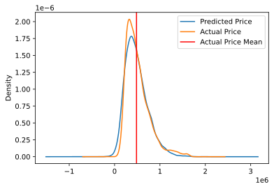
    


```python
x_features = ['sqft_lot15','distance','sqft_living']
outcome = 'price'
X = df[x_features]
```


```python
predictors = '+'.join(x_features)
formula = outcome + '~' + predictors + '-1'
model = ols(formula=formula, data=df).fit()
model.summary()
```


<table class="simpletable">
<caption>OLS Regression Results</caption>
<tr>
  <th>Dep. Variable:</th>          <td>price</td>      <th>  R-squared (uncentered):</th>       <td>   0.900</td>  
</tr>
<tr>
  <th>Model:</th>                   <td>OLS</td>       <th>  Adj. R-squared (uncentered):</th>  <td>   0.900</td>  
</tr>
<tr>
  <th>Method:</th>             <td>Least Squares</td>  <th>  F-statistic:       </th>           <td>4.663e+04</td> 
</tr>
<tr>
  <th>Date:</th>             <td>Mon, 19 Oct 2020</td> <th>  Prob (F-statistic):</th>            <td>  0.00</td>   
</tr>
<tr>
  <th>Time:</th>                 <td>11:10:36</td>     <th>  Log-Likelihood:    </th>          <td>-2.0931e+05</td>
</tr>
<tr>
  <th>No. Observations:</th>      <td> 15479</td>      <th>  AIC:               </th>           <td>4.186e+05</td> 
</tr>
<tr>
  <th>Df Residuals:</th>          <td> 15476</td>      <th>  BIC:               </th>           <td>4.186e+05</td> 
</tr>
<tr>
  <th>Df Model:</th>              <td>     3</td>      <th>                     </th>               <td> </td>     
</tr>
<tr>
  <th>Covariance Type:</th>      <td>nonrobust</td>    <th>                     </th>               <td> </td>     
</tr>
</table>
<table class="simpletable">
<tr>
       <td></td>          <th>coef</th>     <th>std err</th>      <th>t</th>      <th>P>|t|</th>  <th>[0.025</th>    <th>0.975]</th>  
</tr>
<tr>
  <th>sqft_lot15</th>  <td>    0.3536</td> <td>    0.054</td> <td>    6.525</td> <td> 0.000</td> <td>    0.247</td> <td>    0.460</td>
</tr>
<tr>
  <th>distance</th>    <td>-1.012e+04</td> <td>  185.982</td> <td>  -54.434</td> <td> 0.000</td> <td>-1.05e+04</td> <td>-9759.231</td>
</tr>
<tr>
  <th>sqft_living</th> <td>  294.6556</td> <td>    1.163</td> <td>  253.342</td> <td> 0.000</td> <td>  292.376</td> <td>  296.935</td>
</tr>
</table>
<table class="simpletable">
<tr>
  <th>Omnibus:</th>       <td>944.168</td> <th>  Durbin-Watson:     </th> <td>   1.928</td>
</tr>
<tr>
  <th>Prob(Omnibus):</th> <td> 0.000</td>  <th>  Jarque-Bera (JB):  </th> <td>3217.515</td>
</tr>
<tr>
  <th>Skew:</th>          <td> 0.249</td>  <th>  Prob(JB):          </th> <td>    0.00</td>
</tr>
<tr>
  <th>Kurtosis:</th>      <td> 5.177</td>  <th>  Cond. No.          </th> <td>3.94e+03</td>
</tr>
</table><br/><br/>Warnings:<br/>[1] Standard Errors assume that the covariance matrix of the errors is correctly specified.<br/>[2] The condition number is large, 3.94e+03. This might indicate that there are<br/>strong multicollinearity or other numerical problems.


## Homoscedasticity


```python
plt.scatter(model.predict(df[x_features]), model.resid)
plt.plot(model.predict(df[x_features]), [0 for i in range(len(df))])
```


    [<matplotlib.lines.Line2D at 0x22f10240f40>]


    
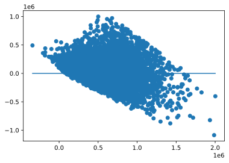
    


### This graph appears to have a slight pattern as opposed to being randomly distributed around the flat 0 axis. I would say there is some heteroskedasticity, and that there may be some evidence that there should be concern that distance from Seattle and square footage are somehow correlated with one another.

## Checking for Normality


```python
fig = sm.graphics.qqplot(model.resid, dist=stats.norm, line='45', fit=True)
```


    
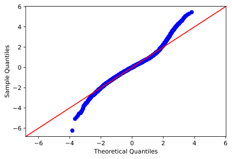
    


### The qq plot for normality indicates that within our dataset are more extreme values than would be expected in a normal distribution. 


## Question 1 Answer and Further Investigation - 
#### When latitude and longitude are included in the regression, their VIF threshold is surpassed by a large margin. A more measured approach might be to look at the data after breaking down the dataset into smaller samples in their specific areas and creating neighborhood specific regressions. This would allow you to truly understand which specific features are affecting home prices, and therefore which to highlight. Location is a huge nonlinear factor on the price of the home.

#### Distance from Seattle, however, does introduce a better feature to the model and is helping to predict price. The graph above shows that our model is missing some information and is anticipating a less peaky distribution whereas the actual home sales are skewed towards the lower price range. Additionally, the distribution of home prices leans to and peaks to the left of the mean home price, indicating positive skewness in the actual home price sales. This is also why our predictive model also peaks just left of the actual price mean.

## Question 2 - Is temporary condition or overall grade (build quality) affecting home price more significantly?


```python
plt.figure(figsize=(11,9))
sns.jointplot(x='grade',y='price', data=df, kind = 'reg', label = column, joint_kws = {'line_kws':{'color':'chartreuse'}})
plt.legend(loc='lower right')
plt.ylabel('Home Price in $1,000,000s',fontsize=12)
plt.xlabel('Build Grade',fontsize=12)
plt.show()
```


    <Figure size 792x648 with 0 Axes>


    

    


```python
plt.figure(figsize=(11,9))
sns.jointplot(x='condition',y ='price', data = df, kind = 'reg', label = column, joint_kws = {'line_kws':{'color':'chartreuse'}})
plt.legend(loc='lower right')
plt.ylabel('Home Price in $1,000,000s',fontsize=12)
plt.xlabel('Home Condition', fontsize=12)
plt.show()
```


    <Figure size 792x648 with 0 Axes>


    

    


## Question 2 Answer and Further Investigation
#### While neither feature was used in our final regressive predictive model, it is clear that original build grade is strongly positively correlated with home prices. Condition may not affect sale price much. This is likely because condition is temporary and can be remedied fairly easily, whereas to change a home's build grade requires substantial renovation from the literal ground up. To further investigate, suggest breaking the data down by geographical location again. The analyis of the entire county is not apples to apples. Real estate in downtown Seattle with a view of the city is not the same as real estate 15 miles south of Seattle.

## Question 3 - What parts of King County command the highest values per square foot?


```python
df.head()
```


<div>
<style scoped>
    .dataframe tbody tr th:only-of-type {
        vertical-align: middle;
    }

    .dataframe tbody tr th {
        vertical-align: top;
    }

    .dataframe thead th {
        text-align: right;
    }
</style>
<table border="1" class="dataframe">
  <thead>
    <tr style="text-align: right;">
      <th></th>
      <th>price</th>
      <th>bedrooms</th>
      <th>bathrooms</th>
      <th>sqft_living</th>
      <th>sqft_lot</th>
      <th>floors</th>
      <th>waterfront</th>
      <th>view</th>
      <th>condition</th>
      <th>grade</th>
      <th>...</th>
      <th>geo_loc</th>
      <th>distance</th>
      <th>PredictedPrice</th>
      <th>$_sqft</th>
      <th>PredictedPrice2</th>
      <th>residuals</th>
      <th>residuals2</th>
      <th>residuals_sq</th>
      <th>residuals_sq2</th>
      <th>Predicted_Price3</th>
    </tr>
  </thead>
  <tbody>
    <tr>
      <th>1</th>
      <td>538000.00</td>
      <td>3</td>
      <td>2.25</td>
      <td>2570</td>
      <td>7242</td>
      <td>2.00</td>
      <td>0.00</td>
      <td>0.00</td>
      <td>3</td>
      <td>7</td>
      <td>...</td>
      <td>(47.721, -122.319)</td>
      <td>7.01</td>
      <td>636495.58</td>
      <td>209.34</td>
      <td>693272.04</td>
      <td>98495.58</td>
      <td>155272.04</td>
      <td>9701378397.44</td>
      <td>24109405995.73</td>
      <td>693272.04</td>
    </tr>
    <tr>
      <th>3</th>
      <td>604000.00</td>
      <td>4</td>
      <td>3.00</td>
      <td>1960</td>
      <td>5000</td>
      <td>1.00</td>
      <td>0.00</td>
      <td>0.00</td>
      <td>5</td>
      <td>7</td>
      <td>...</td>
      <td>(47.521, -122.393)</td>
      <td>7.23</td>
      <td>532524.11</td>
      <td>308.16</td>
      <td>509721.03</td>
      <td>71475.89</td>
      <td>94278.97</td>
      <td>5108803562.50</td>
      <td>8888524181.97</td>
      <td>509721.03</td>
    </tr>
    <tr>
      <th>4</th>
      <td>510000.00</td>
      <td>3</td>
      <td>2.00</td>
      <td>1680</td>
      <td>8080</td>
      <td>1.00</td>
      <td>0.00</td>
      <td>0.00</td>
      <td>3</td>
      <td>8</td>
      <td>...</td>
      <td>(47.617, -122.045)</td>
      <td>14.29</td>
      <td>435320.19</td>
      <td>303.57</td>
      <td>355297.87</td>
      <td>74679.81</td>
      <td>154702.13</td>
      <td>5577073714.90</td>
      <td>23932749191.48</td>
      <td>355297.87</td>
    </tr>
    <tr>
      <th>5</th>
      <td>1230000.00</td>
      <td>4</td>
      <td>4.50</td>
      <td>5420</td>
      <td>101930</td>
      <td>1.00</td>
      <td>0.00</td>
      <td>0.00</td>
      <td>3</td>
      <td>11</td>
      <td>...</td>
      <td>(47.656, -122.005)</td>
      <td>16.31</td>
      <td>1235577.25</td>
      <td>226.94</td>
      <td>1446747.10</td>
      <td>5577.25</td>
      <td>216747.10</td>
      <td>31105681.45</td>
      <td>46979306838.19</td>
      <td>1446747.10</td>
    </tr>
    <tr>
      <th>6</th>
      <td>257500.00</td>
      <td>3</td>
      <td>2.25</td>
      <td>1715</td>
      <td>6819</td>
      <td>2.00</td>
      <td>0.00</td>
      <td>0.00</td>
      <td>3</td>
      <td>7</td>
      <td>...</td>
      <td>(47.31, -122.327)</td>
      <td>21.58</td>
      <td>265123.53</td>
      <td>150.15</td>
      <td>292120.19</td>
      <td>7623.53</td>
      <td>34620.19</td>
      <td>58118271.30</td>
      <td>1198557320.06</td>
      <td>292120.19</td>
    </tr>
  </tbody>
</table>
<p>5 rows × 25 columns</p>
</div>


```python
fig1 = plt.figure(figsize=(12,9))
ax1 = sns.scatterplot(x=df['long'],y=df['lat'],hue=df['$_sqft'],size=df['price'],palette='Blues')
ax1.add_patch(patches.Circle((-122.225,47.565),.035,alpha=0.3,facecolor='green',edgecolor='black',linewidth=1,linestyle='solid',label='Mercer Island'))
ax1.add_patch(patches.Circle((-122.22,47.625),.025,alpha=0.3,facecolor='red',edgecolor='black',linewidth=1,linestyle='solid',label='Bellevue'))
ax1.add_patch(patches.Circle((-122.30,47.633),.028,alpha=0.3,facecolor='orange',edgecolor='black',linewidth=1,linestyle='solid',label='Capitol Hill'))
ax1.add_patch(patches.Circle((-122.4,47.65),.027,alpha=0.3,facecolor='yellow',edgecolor='black',linewidth=1,linestyle='solid',label='Magnolia'))
plt.legend(loc='lower right')
plt.title('Price per Square Foot in King County')
plt.ylabel('Latitude')
plt.xlabel('Longitude')
plt.show()
```


    

    


## Question 3 Answer and Further Investigation
#### Bellevue, Capitol Hill, Magnolia, and Mercer Island have homes that are more expensive per square foot. Mercer Island has large homes and you can get more for your dollar compared with Bellevue. Generally speaking, properties south of Seattle in King County are not as valuable, but we can't pinpoint or recommend why that may be other than location. 

#### Isolating these specific locations and neighborhoods in separate regressions analyses will likely be an efficient way to build a better predictive model, the limitation being that the model can't be applied to different neighborhoods.

## Question 4 - Our realtor client is most interested in Mercer Island. The client would like to know what features of homes on Mercer Island are most desirable. Let's investigate this specific portion of King County to provide them with an actionable recommendation.


```python
# for this question we need to import the csv with zipcodes and remove everything except for 98040 which is unique to Mercer Island.
```


```python
df_mercer = df[df['zipcode']==98040]
df_mercer.head() # Let's look at summary data and then run a regression with price as the target
```


<div>
<style scoped>
    .dataframe tbody tr th:only-of-type {
        vertical-align: middle;
    }

    .dataframe tbody tr th {
        vertical-align: top;
    }

    .dataframe thead th {
        text-align: right;
    }
</style>
<table border="1" class="dataframe">
  <thead>
    <tr style="text-align: right;">
      <th></th>
      <th>price</th>
      <th>bedrooms</th>
      <th>bathrooms</th>
      <th>sqft_living</th>
      <th>sqft_lot</th>
      <th>floors</th>
      <th>waterfront</th>
      <th>view</th>
      <th>condition</th>
      <th>grade</th>
      <th>...</th>
      <th>geo_loc</th>
      <th>distance</th>
      <th>PredictedPrice</th>
      <th>$_sqft</th>
      <th>PredictedPrice2</th>
      <th>residuals</th>
      <th>residuals2</th>
      <th>residuals_sq</th>
      <th>residuals_sq2</th>
      <th>Predicted_Price3</th>
    </tr>
  </thead>
  <tbody>
    <tr>
      <th>95</th>
      <td>905000.00</td>
      <td>4</td>
      <td>2.50</td>
      <td>3300</td>
      <td>10250</td>
      <td>1.00</td>
      <td>0.00</td>
      <td>0.00</td>
      <td>3</td>
      <td>7</td>
      <td>...</td>
      <td>(47.587, -122.249)</td>
      <td>5.36</td>
      <td>773094.52</td>
      <td>274.24</td>
      <td>927006.11</td>
      <td>131905.48</td>
      <td>22006.11</td>
      <td>17399055351.15</td>
      <td>484268786.94</td>
      <td>927006.11</td>
    </tr>
    <tr>
      <th>192</th>
      <td>799000.00</td>
      <td>3</td>
      <td>2.50</td>
      <td>2140</td>
      <td>9897</td>
      <td>1.00</td>
      <td>0.00</td>
      <td>0.00</td>
      <td>4</td>
      <td>8</td>
      <td>...</td>
      <td>(47.55, -122.219)</td>
      <td>7.93</td>
      <td>623216.25</td>
      <td>373.36</td>
      <td>556172.06</td>
      <td>175783.75</td>
      <td>242827.94</td>
      <td>30899928224.98</td>
      <td>58965410087.59</td>
      <td>556172.06</td>
    </tr>
    <tr>
      <th>351</th>
      <td>855000.00</td>
      <td>4</td>
      <td>2.75</td>
      <td>2270</td>
      <td>10460</td>
      <td>2.00</td>
      <td>0.00</td>
      <td>0.00</td>
      <td>3</td>
      <td>9</td>
      <td>...</td>
      <td>(47.56, -122.222)</td>
      <td>7.40</td>
      <td>662328.45</td>
      <td>376.65</td>
      <td>600150.98</td>
      <td>192671.55</td>
      <td>254849.02</td>
      <td>37122325931.15</td>
      <td>64948024084.04</td>
      <td>600150.98</td>
    </tr>
    <tr>
      <th>385</th>
      <td>799000.00</td>
      <td>4</td>
      <td>2.25</td>
      <td>2510</td>
      <td>11585</td>
      <td>2.00</td>
      <td>0.00</td>
      <td>0.00</td>
      <td>4</td>
      <td>8</td>
      <td>...</td>
      <td>(47.548, -122.226)</td>
      <td>7.77</td>
      <td>651125.17</td>
      <td>318.33</td>
      <td>667798.13</td>
      <td>147874.83</td>
      <td>131201.87</td>
      <td>21866964529.73</td>
      <td>17213930350.99</td>
      <td>667798.13</td>
    </tr>
    <tr>
      <th>454</th>
      <td>811000.00</td>
      <td>3</td>
      <td>1.75</td>
      <td>1870</td>
      <td>9897</td>
      <td>1.00</td>
      <td>0.00</td>
      <td>0.00</td>
      <td>4</td>
      <td>8</td>
      <td>...</td>
      <td>(47.55, -122.221)</td>
      <td>7.86</td>
      <td>575546.95</td>
      <td>433.69</td>
      <td>476634.93</td>
      <td>235453.05</td>
      <td>334365.07</td>
      <td>55438137249.07</td>
      <td>111800000127.78</td>
      <td>476634.93</td>
    </tr>
  </tbody>
</table>
<p>5 rows × 25 columns</p>
</div>


```python
x_features = ['sqft_living','sqft_lot']
outcome = 'price'
X = df_mercer[x_features]
```


```python
predictors = '+'.join(x_features)
formula = outcome + '~' + predictors + '-1'
model = ols(formula=formula, data=df_mercer).fit()
model.summary()
```


<table class="simpletable">
<caption>OLS Regression Results</caption>
<tr>
  <th>Dep. Variable:</th>          <td>price</td>      <th>  R-squared (uncentered):</th>      <td>   0.961</td> 
</tr>
<tr>
  <th>Model:</th>                   <td>OLS</td>       <th>  Adj. R-squared (uncentered):</th> <td>   0.961</td> 
</tr>
<tr>
  <th>Method:</th>             <td>Least Squares</td>  <th>  F-statistic:       </th>          <td>   2179.</td> 
</tr>
<tr>
  <th>Date:</th>             <td>Mon, 19 Oct 2020</td> <th>  Prob (F-statistic):</th>          <td>2.17e-124</td>
</tr>
<tr>
  <th>Time:</th>                 <td>11:12:51</td>     <th>  Log-Likelihood:    </th>          <td> -2415.6</td> 
</tr>
<tr>
  <th>No. Observations:</th>      <td>   177</td>      <th>  AIC:               </th>          <td>   4835.</td> 
</tr>
<tr>
  <th>Df Residuals:</th>          <td>   175</td>      <th>  BIC:               </th>          <td>   4842.</td> 
</tr>
<tr>
  <th>Df Model:</th>              <td>     2</td>      <th>                     </th>              <td> </td>    
</tr>
<tr>
  <th>Covariance Type:</th>      <td>nonrobust</td>    <th>                     </th>              <td> </td>    
</tr>
</table>
<table class="simpletable">
<tr>
       <td></td>          <th>coef</th>     <th>std err</th>      <th>t</th>      <th>P>|t|</th>  <th>[0.025</th>    <th>0.975]</th>  
</tr>
<tr>
  <th>sqft_living</th> <td>  325.8235</td> <td>   10.238</td> <td>   31.824</td> <td> 0.000</td> <td>  305.617</td> <td>  346.030</td>
</tr>
<tr>
  <th>sqft_lot</th>    <td>    5.0139</td> <td>    2.028</td> <td>    2.473</td> <td> 0.014</td> <td>    1.012</td> <td>    9.016</td>
</tr>
</table>
<table class="simpletable">
<tr>
  <th>Omnibus:</th>       <td>32.535</td> <th>  Durbin-Watson:     </th> <td>   1.962</td>
</tr>
<tr>
  <th>Prob(Omnibus):</th> <td> 0.000</td> <th>  Jarque-Bera (JB):  </th> <td>  92.188</td>
</tr>
<tr>
  <th>Skew:</th>          <td>-0.721</td> <th>  Prob(JB):          </th> <td>9.59e-21</td>
</tr>
<tr>
  <th>Kurtosis:</th>      <td> 6.228</td> <th>  Cond. No.          </th> <td>    10.1</td>
</tr>
</table><br/><br/>Warnings:<br/>[1] Standard Errors assume that the covariance matrix of the errors is correctly specified.


## Homoscedasticity


```python
plt.scatter(model.predict(df_mercer[x_features]), model.resid)
plt.plot(model.predict(df_mercer[x_features]), [0 for i in range(len(df_mercer))])
plt.ylabel('Residual Amount',fontsize=12)
plt.xlabel('Home Price Actual', fontsize=12)
plt.show()
```


    
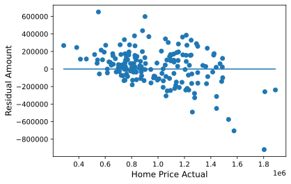
    


### Near homoskedastic residual plot for Mercer Island but using grade feature in place of distance since Mercer Island was the focus. Results in a low condition number and high R-squared.

## Checking for Normality


```python
fig = sm.graphics.qqplot(model.resid, dist=stats.norm, line='45', fit=True)
```


    
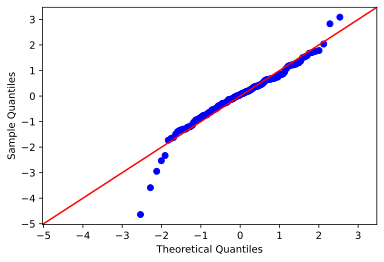
    


### QQ plot checks for normality - good overall test with indication that there are a few outliers in the predictive model. 

## Question 4 Answer and Further Investigation
#### 

### Isolating the home sales on Mercer Island allowed us to isolate a smaller market to understand which features best predict the target. Let's run a quick check model formula for the Mercer Isand data. 

### We recommend that the realtor highlight interior square footage, size of lot, and overal proximity to the city. The most important takeaway from our investigations is location, location, location. Can further isolate neighborhoods in further investigation and regressions, but many features that we started with are either trivial or autocorrelated and can't be used in regression. 


```python
finalreg = cm(df_mercer,['sqft_living','sqft_lot'],'price',add_constant=False,show_summary=True,vif_threshold=3.5) # cm is check model function from statsFunctions.py
print(finalreg)
```

    sqft_living surpassed threshold with vif=3.776673540885498
    sqft_lot surpassed threshold with vif=3.776673540885498
    Model contains multicollinear features
                                     OLS Regression Results                                
    =======================================================================================
    Dep. Variable:                  price   R-squared (uncentered):                   0.961
    Model:                            OLS   Adj. R-squared (uncentered):              0.961
    Method:                 Least Squares   F-statistic:                              2179.
    Date:                Mon, 19 Oct 2020   Prob (F-statistic):                   2.17e-124
    Time:                        11:13:02   Log-Likelihood:                         -2415.6
    No. Observations:                 177   AIC:                                      4835.
    Df Residuals:                     175   BIC:                                      4842.
    Df Model:                           2                                                  
    Covariance Type:            nonrobust                                                  
    ===============================================================================
                      coef    std err          t      P>|t|      [0.025      0.975]
    -------------------------------------------------------------------------------
    sqft_living   325.8235     10.238     31.824      0.000     305.617     346.030
    sqft_lot        5.0139      2.028      2.473      0.014       1.012       9.016
    ==============================================================================
    Omnibus:                       32.535   Durbin-Watson:                   1.962
    Prob(Omnibus):                  0.000   Jarque-Bera (JB):               92.188
    Skew:                          -0.721   Prob(JB):                     9.59e-21
    Kurtosis:                       6.228   Cond. No.                         10.1
    ==============================================================================
    
    Warnings:
    [1] Standard Errors assume that the covariance matrix of the errors is correctly specified.
    Residuals failed test/tests
    <statsmodels.regression.linear_model.RegressionResultsWrapper object at 0x0000022F115873D0>
    

Somewhat higher VIF score, but acceptable at 3.78. For each addition square foot of living space, the model predicts (on Mercer Island) that the price of the home will go up by 325.8. For each sqauare foot of lot space, the price will increase by 5.01.


```python

```
