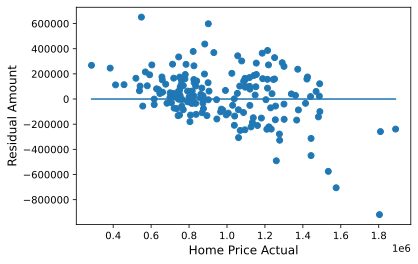
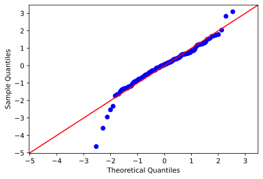

# King County Housing Analysis

##### [Slideshow PDF]
##### [Video Walkthrough](https://github.com/JosephDenney/MicrosoftMovie/blob/master/zoom_0.mp4)

### Outline
* [Purpose](#Purpose)
* [King County Map](#King_County_General_Map)
* [Description of Data](#Description_of_Data)
* [Main Questions](#Main-Questions)
* [Summary Conclusions and Insights](#Summary-Conclusions-and-Insights)
* [Future Work](#Future-Work)

## Purpose

#### Create a general understanding of important housing features in King County. Our client is a realtor in the county and has tasked us in helping to explain the most important, or value driving features of homes within the county. 

## King County General Map

## Description of Data

## Main Questions
* Question 1: How does longitude and latitude affect home price in King County?
* Question 2: Is temporary condition or overall grade (build quality) affecting home price more significantly?
* Question 3: What parts of King County command the highest values per square foot?
* Question 4: Our realtor client is most interested in Mercer Island. The client would like to know what features of homes on Mercer Island are most desirable. Let's investigate this specific portion of King County to provide them with an actionable recommendation.

## Summary Conclusions and Insights
* Question 1 Answer and Further Investigation: When latitude and longitude are included in the regression, their VIF threshold is surpassed by a large margin. A more measured approach might be to look at the data after breaking down the dataset into smaller samples in their specific areas and creating neighborhood specific regressions. This would allow you to truly understand which specific features are affecting home prices, and therefore which to highlight. Location is a huge nonlinear factor on the price of the home.

Distance from Seattle, however, does introduce a better feature to the model and is somewhat helpful in the prediction of price. The graph shows that our model is missing some information and is anticipating a less peaky distribution whereas the actual home sales are skewed towards the lower price range. Additionally, the distribution of home prices leans to and peaks to the left of the mean home price, indicating positive skewness in the actual home price sales. This is also why our predictive model also peaks just left of the actual price mean.

* Question 2 Answer and Further Investigation: While neither feature was used in our final regressive predictive model, it is clear that original build grade is strongly positively correlated with home prices. Condition may not affect sale price much. This is likely because condition is temporary and can be remedied fairly easily, whereas to change a home's build grade requires substantial renovation from the literal ground up. To further investigate, suggest breaking the data down by geographical location again. The analyis of the entire county is not apples to apples. Real estate in downtown Seattle with a view of the city is not the same as real estate 15 miles south of Seattle.

* Question 3 Answer and Further Investigation: Bellevue, Capitol Hill, Magnolia, and Mercer Island have homes that are more expensive per square foot. Mercer Island has large homes and you can get more for your dollar compared with Bellevue. Generally speaking, properties south of Seattle in King County are not as valuable, but we can't pinpoint or recommend why that may be other than location. Isolating these specific locations and neighborhoods in separate regressions analyses will likely be an efficient way to build a better predictive model, the limitation being that the model can't be applied to different neighborhoods.

* Question 4 Answer and Further Investigation: Isolating the home sales on Mercer Island allowed us to isolate a smaller market to understand which features best predict the target. Let's run a quick check model formula for the Mercer Isand data. We recommend that the realtor highlight interior square footage, size of lot, and overal proximity to the city. The most important takeaway from our investigations is location, location, location. Can further isolate neighborhoods in further investigation and regressions, but many features that we started with are either trivial or autocorrelated and can't be used in regression.

## Future Work
* Analysis of the housing market must be neighborhood specific. Individuals with different income are going to be able to afford what they can afford. Similarly, not every person will put the same importance on specific features that another would. Breaking datasets into neighborhoods is crucial to building a model. 
* Isolate which neighborhoods that are most important to the client and create neighborhood specific models. 
* Create functions to quickly optimize the model

### Thank you!
